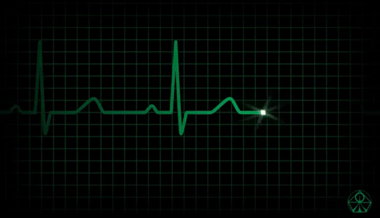
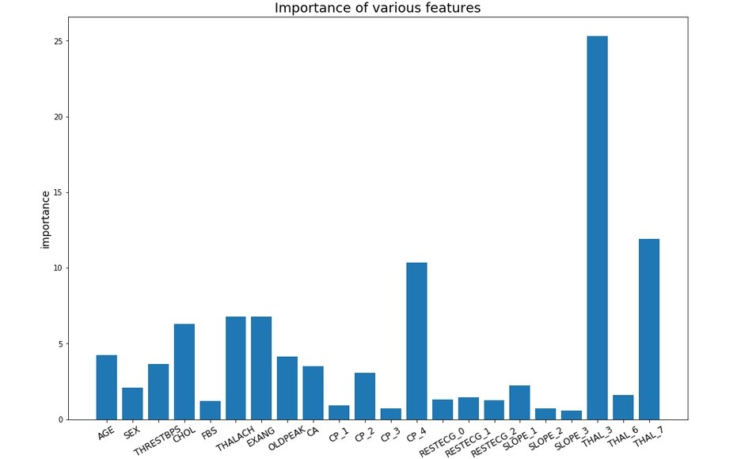
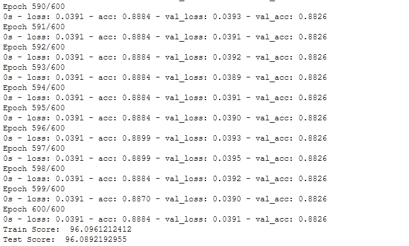
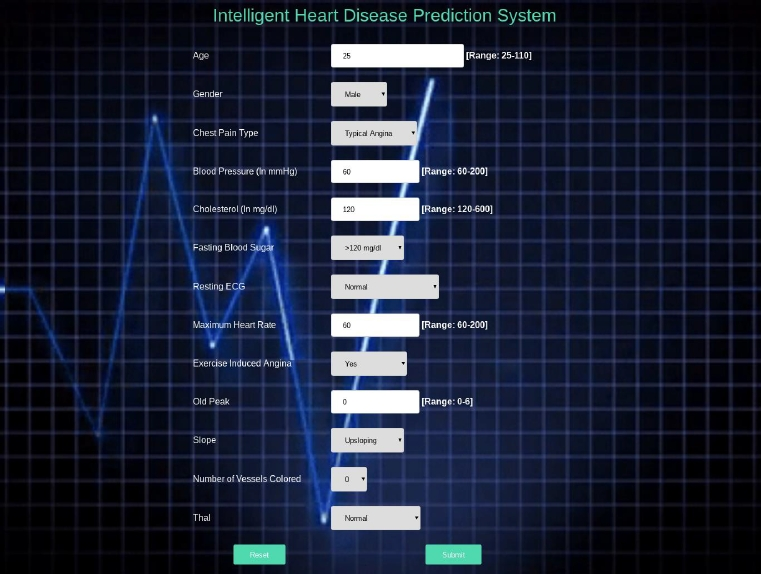
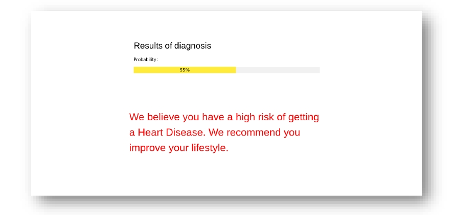

# Heart Disease Risk Prediction

Here we tested various machine learning algorithms on UCI heart disease dataset to predict the risk one person has towards the heart disease.Our goal is to predict the probablity if a person will be daignosed with a heart disease with maximum accuracy and find out which attributes most towards the heart disease.

This dataset contains 4 databases concerning heart disease diagnosis. All attributes are numeric-valued. The data was collected from the four following locations:

1. Cleveland Clinic Foundation
2. Hungarian Institute of Cardiology, Budapest
3. V.A. Medical Center, Long Beach, CA
4. University Hospital, Zurich, Switzerland
 
 
## Attribute Information:

  1. age:age in years       
  2. sex:(1 = male; 0 = female)       
  3. cp:chest pain type
     - Value 1: typical angina
     - Value 2: atypical angina
     - Value 3: non-anginal pain
     - Value 4: asymptomatic
  4. trestbps: resting blood pressure  
  5. chol:cholestoral      
  6. fbs:(fasting blood sugar > 120 mg/dl)  (1 = true; 0 = false)    
  7. restecg:
      - Value 0: normal
      - Value 1: having ST-T wave abnormality 
      - Value 2: showing probable or definite left ventricular hypertrophy
  8. thalach:maximum heart rate achieved
  9. exang:exercise induced angina (1 = yes; 0 = no)     
  10. oldpeak:ST depression induced by exercise relative to rest   
  11. slope:the slope of the peak exercise ST segment
      - Value 1: upsloping
      - Value 2: flat
      - Value 3: downsloping     
  12. ca: number of major vessels (0-3) colored by flourosopy        
  13. thal: 
      - 3 = normal
      - 6 = fixed defect
      - 7 = reversable defect 
  14. category:diagnosis of heart disease[0-4]       (the predicted attribute)

**Here 1-4 represents diagnosis to be True, and 0 represents absence of heart disease**

## Attribute Importance based on ExtraTreeClassifier

## Testing and Training

**USING NEURAL N/W WITH 2 LAYERS WE GOT AN ACCURACY:96% and PRECISION:93%**

## FRONT END AND RESULTS

